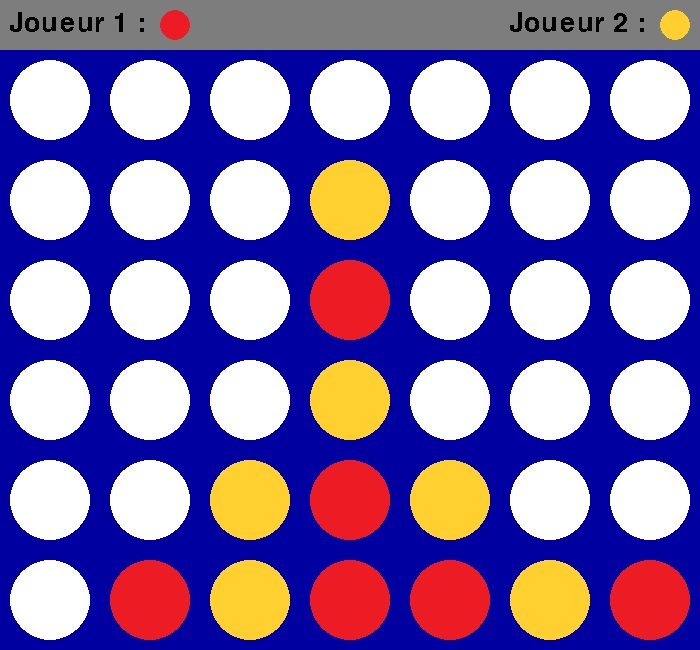

# Python-Connect-4-Game

This is a reproduction of the famous board game "Connect 4".
## Features
- Player versus player
- Player versus AI
## Installation
1. Download the repository by clicking on `Code > Download ZIP`
2. Extract the ZIP file
3. Run `main.pyw`
## Requirements
- Python 3.7
- Python `pygame` library
- Python `random` library